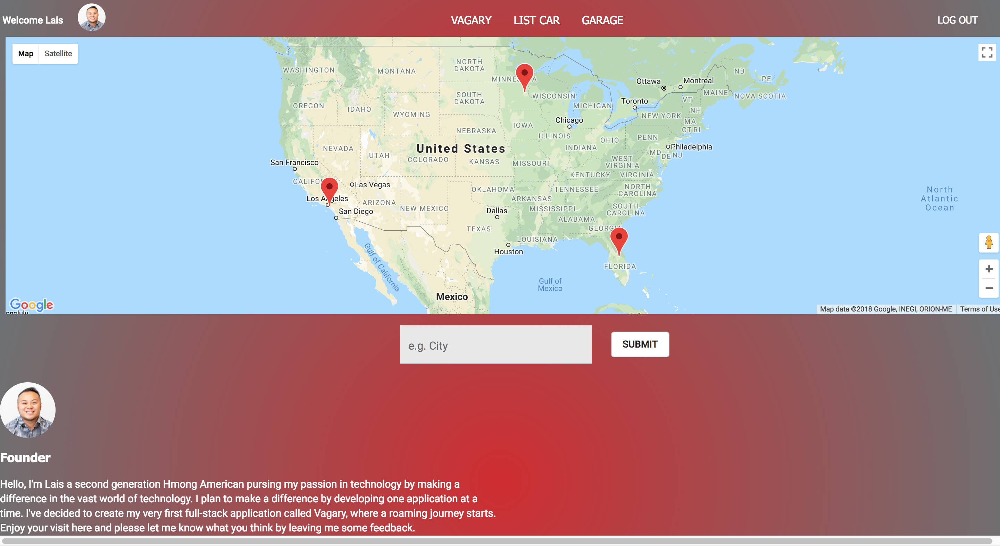

# Vagary
Vagary is an application that offers affordable rental pricing for vehicles to tourist/locals wherever they plan to visit. Anyone can access the site and view the different vehicles that are available to rent. In order for a user to be a renter or complete a rent, that user will have to create an account with the application to be able to checkout/add their vehicle.  

## Prerequisites

Before you get started, make sure you have the following software installed on your computer:

- [Node.js](https://nodejs.org/en/)
- [PostrgeSQL](https://www.postgresql.org/)
- [Nodemon](https://nodemon.io/)

## Development Setup Instructions
Steps to get the development environment running.
1. Download this repo from github (click the lime green clone or download button)

2. Create a .env file at the root of the project and paste this line into the file:
SERVER_SESSION_SECRET=superDuperSecret
REACT_APP_CLOUD=REACT_APP_CLOUD
REACT_APP_CLOUDINARY_API_KEY=yourAPIKEY
REACT_APP_CLOUDINARY_API_KEY_SECRET=APIKEYsecret
REACT_APP_CLOUDINARY_UPLOAD_PRESET=Preset

3. While you're in your new .env file, take the time to replace superDuperSecret with some long random string like 25POUbVtx6RKVNWszd9ERB9Bb6 to keep your application secure. Here's a site that can help you: 

https://passwordsgenerator.net/. 

If you don't do this step, create a secret with less than eight characters, or leave it as superDuperSecret, you will get a warning.

All information for cloudinary will be on your landing page, settings, settings-privacy. 

Google Maps API are used from 

4. run npm install in the terminal under this project 

5. Start postgres if not running already by using `brew services start postgresql` (in terminal)

6. Set up your database:

Create a new database called `vagary`(or whatever you would like to call it) and create a `person`, `car`, and `trip` table:

```SQL
CREATE TABLE "person" (
    "id" serial NOT NULL,
    "email" varchar (255) NOT NULL,
    "password" varchar (255) NOT NULL,
    "first" varchar (255) NOT NULL,
    "last" varchar (255) NOT NULL ,
    "phone" integer NOT NULL ,
    "street_name" varchar (255) NOT NULL ,
    "city" varchar (255) NOT NULL,
    "state" varchar (255) NOT NULL ,
    "zipcode" integer NOT NULL ,
    "credit_card" integer NOT NULL,
    "ccv" integer NOT NULL ,
    "exp_month" integer NOT NULL,
    "exp_day" integer NOT NULL,
    CONSTRAINT Person_pk PRIMARY KEY ("id")
) WITH (
  OIDS=FALSE
);

DROP TABLE "car";


CREATE TABLE "car" (
    "car_id" serial NOT NULL,
    "person_id" serial NOT NULL,
    "available" BOOLEAN DEFAULT 'true',
    "make" varchar(255) NOT NULL ,
    "model" varchar(255) NOT NULL ,
    "color" varchar(255) NOT NULL ,
    "year" integer NOT NULL ,
    "city" varchar(255) NOT NULL ,
    "state" varchar(255) NOT NULL ,
    "latitude" float4 NOT NULL ,
    "longitude" float4 NOT NULL ,
    CONSTRAINT car_pk PRIMARY KEY ("car_id")
) WITH (
  OIDS=FALSE
);


CREATE TABLE "trip" (
    "id" serial NOT NULL,
    "car_id" serial NOT NULL,
    "person_id" serial NOT NULL,
    "start_time" TIMESTAMP NOT NULL,
    "end_time" TIMESTAMP NOT NULL,
    "cost" float4 NOT NULL,
    "review" varchar(255) NOT NULL,
    "rating" integer NOT NULL,
    
    CONSTRAINT trip_pk PRIMARY KEY ("id")
) WITH (
  OIDS=FALSE
);


ALTER TABLE "car" ADD CONSTRAINT "car_fk0" FOREIGN KEY ("person_id") REFERENCES "person"("id");

ALTER TABLE "trip" ADD CONSTRAINT "trip_fk0" FOREIGN KEY ("person_id") REFERENCES "person"("id");
ALTER TABLE "trip" ADD CONSTRAINT "trip_fk1" FOREIGN KEY ("car_id") REFERENCES "car"("car_id");
```

If you would like to name your database something else, you will need to change `vagary` to the name of your new database name in `server/modules/pool.js`


7. Run `npm run server`

8. Run `npm run client`

9. Navigate to localhost:3000


### Built With
 - JavaScript
 - React
 - React-Redux
 - Material-UI
 - PostgreSQL
 - HTML5
 - CSS3
 - React-Sagas
 - Moment.JS
 - Node.JS
 - Express.JS
 - Passport
 - Google Maps API
 - Google Geocode API
 - Cloudinary

## Screen Shot


## FEATURES
- Cloudinary for image upload
- Google Maps on landing page
- Geocode for longitude and latitude search
- Moment.JS for timing


### Authors

- Lais Vang
- Google Map React: Ari
